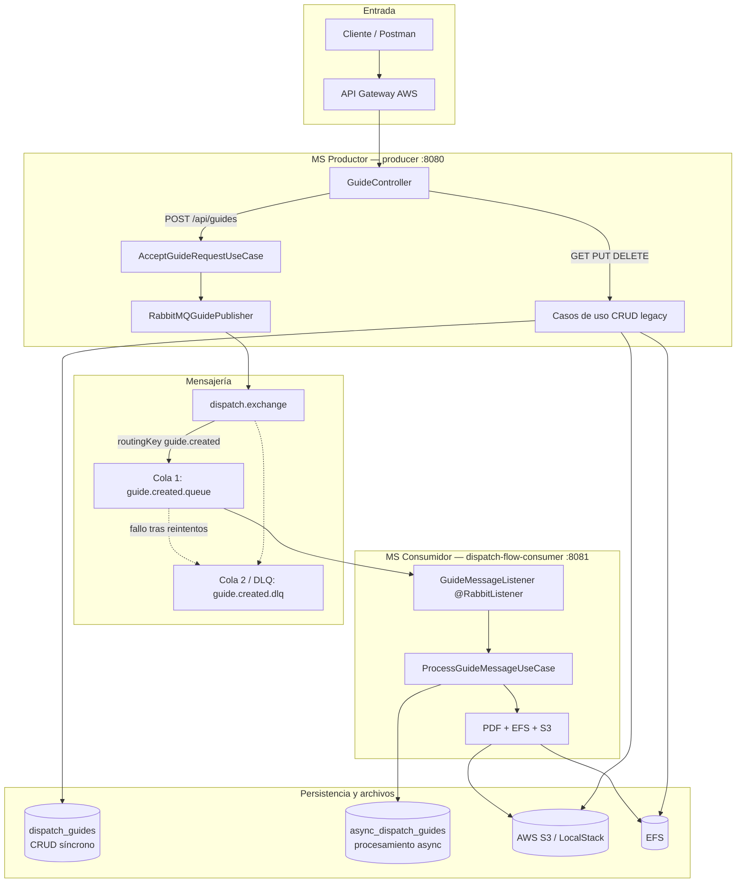
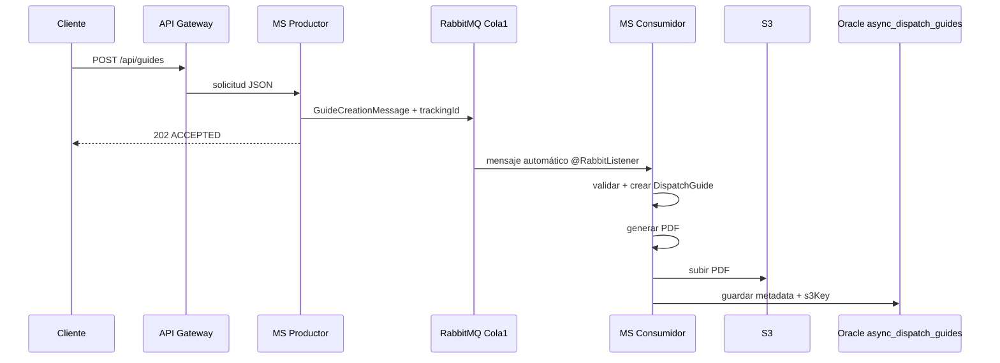
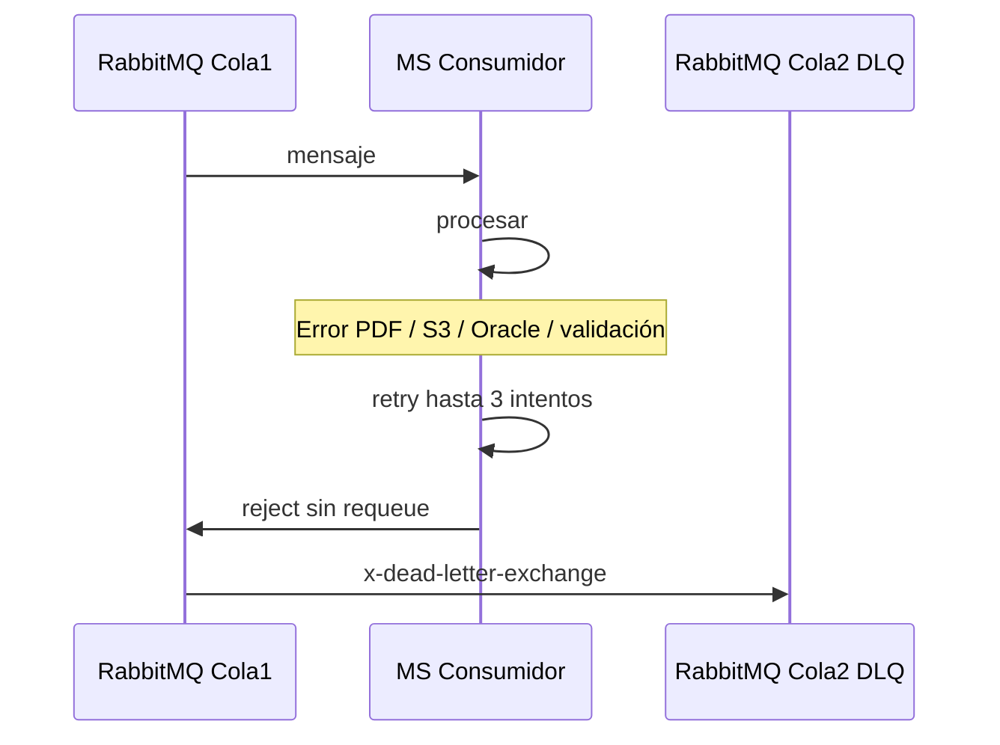
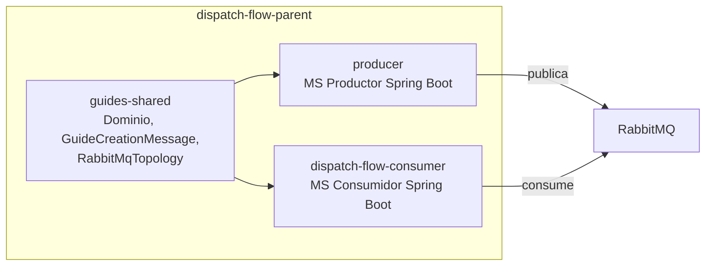

# Arquitectura del sistema — Guías de despacho

Este documento describe cómo se conectan los microservicios, RabbitMQ y los almacenamientos en el flujo asíncrono de creación de guías.

## Vista general de componentes



## Flujo 1 — Crear guía (asíncrono)

Responsabilidad del **productor**: recibir, publicar y responder. No genera PDF ni persiste la guía final.



## Flujo 2 — Error y DLQ



## Estructura del repositorio (Maven multi-módulo)



| Módulo | Artefacto | Puerto | Rol |
|--------|-----------|--------|-----|
| `guides-shared` | librería JAR | — | Contratos y dominio compartido |
| `producer` | `dispatch-flow-api` | 8080 | API REST, publicador RabbitMQ, CRUD legacy |
| `dispatch-flow-consumer` | `dispatch-flow-consumer` | 8081 | Listener, procesamiento, S3, tabla async |

## Topología RabbitMQ

| Recurso | Nombre |
|---------|--------|
| Exchange | `dispatch.exchange` (direct) |
| Cola principal | `guide.created.queue` (durable) |
| DLQ | `guide.created.dlq` (durable) |
| Routing key principal | `guide.created.routingKey` |
| Routing key DLQ | `guide.created.dlqRoutingKey` |

La configuración se declara en Java (`RabbitMQConfig`) al arrancar cada microservicio. No hay endpoints HTTP para crear colas.

## Separación de responsabilidades

| Acción | MS Productor | MS Consumidor |
|--------|:------------:|:-------------:|
| Recibir POST /api/guides | ✓ | |
| Publicar en Cola 1 | ✓ | |
| Responder 202 ACCEPTED | ✓ | |
| Escuchar Cola 1 | | ✓ |
| Generar PDF | | ✓ |
| Subir S3 | | ✓ |
| Guardar en `async_dispatch_guides` | | ✓ |
| CRUD sobre `dispatch_guides` | ✓ | |
| Enviar fallos a DLQ | | ✓ |

## Despliegue local

```bash
docker compose up -d          # RabbitMQ + LocalStack
./run-local                   # productor :8080
./run-consumer                # consumidor :8081
```

Consola RabbitMQ: http://localhost:15672 (credenciales en `.env` o `guest`/`guest`).
